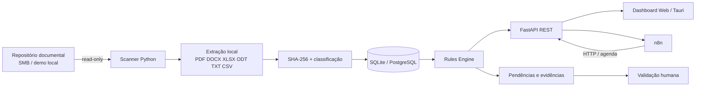

# Central ISO

> Piloto técnico de automação documental para Sistema de Gestão da Qualidade (SGQ), com varredura read-only, regras determinísticas, rastreabilidade, alertas e orquestração via n8n.

[](https://github.com/Mayconxzdev/Central-ISO/actions/workflows/ci.yml)


## Visão geral

O **Central ISO** nasceu de um problema real observado em uma operação industrial: informações do SGQ distribuídas em pastas de rede, conferências manuais de documentos, certificados e não conformidades (NCs), além de forte dependência do conhecimento das pessoas para localizar e acompanhar evidências.

A proposta foi transformar parte desse trabalho em um pipeline determinístico e auditável, sem alterar os documentos oficiais e sem depender de serviços pagos ou de IA externa.

**Estado real:** piloto técnico / prova de conceito funcional. O código e a arquitetura foram validados de ponta a ponta em ambiente controlado; o projeto **não é apresentado como sistema certificado, auditor ISO ou implantação corporativa em produção**.

## O que o projeto demonstra

- levantamento de requisitos e tradução de regras de negócio em software;
- leitura de repositório documental em modo **somente leitura**;
- varredura incremental com **SHA-256** para idempotência e deduplicação;
- extração local de PDF, DOCX, XLSX, ODT, TXT e CSV;
- classificação e acompanhamento de certificados, NCs e documentos do SGQ;
- regras determinísticas para prazos, eficácia, pendências e necessidade de confirmação humana;
- API REST com FastAPI e persistência relacional;
- workflows n8n para agendamento, consultas, alertas e recuperação;
- wrapper desktop com Tauri v2;
- Docker Compose para execução reproduzível;
- suíte automatizada com **30 testes aprovados e 1 teste ignorado** na auditoria desta versão pública.

## Demonstração pública

A interface incluída em `app/static/` roda com dados sintéticos de `demo_iso/`. A versão pública não inclui capturas do ambiente corporativo original; isso evita expor marcas, nomes, contagens ou detalhes de terceiros fora do contexto em que foram produzidos.

O foco deste repositório é permitir que qualquer pessoa valide o fluxo pelo código, testes e demo local.

## Arquitetura



A fonte documental oficial é tratada como entrada de leitura. O sistema não precisa modificar arquivos do SGQ para gerar seu inventário, seus alertas ou suas evidências.

## Stack

| Área | Tecnologias |
|---|---|
| Backend | Python, FastAPI, SQLAlchemy, Uvicorn |
| Dados | SQLite (demo), PostgreSQL (Docker) |
| Documentos | PyMuPDF, pypdf, python-docx, openpyxl, odfpy |
| Automação | n8n, REST, HTTP, agendamentos |
| Desktop | Tauri v2 / Rust |
| Infraestrutura | Docker, Docker Compose |
| Qualidade | pytest, compileall, GitHub Actions |

## Executar a demonstração

A configuração pública inicia em modo de demonstração e utiliza somente os arquivos sintéticos em `demo_iso/`. Certificados, fornecedores, pessoas e cenários da demo usam identificadores fictícios e não representam registros reais.

### Opção 1 — Python local

```bash
python -m venv .venv
# Windows: .venv\Scripts\activate
# Linux/macOS: source .venv/bin/activate
python -m pip install -r requirements.txt

# Windows PowerShell
$env:APP_DATA_MODE="demo"
$env:ISO_SOURCE_PATH="./demo_iso"
uvicorn app.main:app --reload --port 8877
```

Abra `http://127.0.0.1:8877`.

### Opção 2 — Docker Compose

```bash
cp .env.example .env
docker compose up --build
```

Serviços:

- Central ISO: `http://localhost:8877`
- Swagger/OpenAPI: `http://localhost:8877/docs`
- n8n: `http://localhost:5678`

> Os valores padrão do `.env.example` são exclusivos para demonstração. Nunca reutilize essas credenciais em um ambiente real.

## Workflows n8n

O diretório `n8n/` contém quatro workflows exportados sem credenciais:

1. atualização e análise;
2. consultas e relatórios;
3. alertas e acompanhamento;
4. erros e recuperação.

Eles consomem a API do Central ISO por HTTP e demonstram a separação entre **orquestração** e **regras de domínio**.

## Segurança e privacidade

A versão pública foi preparada para não depender de infraestrutura, dados ou credenciais corporativas reais.

Principais decisões:

- volume documental montado como `:ro` no Docker;
- `.env` ignorado pelo Git;
- nenhum token ou credencial real incluído;
- dados de `demo_iso/` são sintéticos;
- processamento documental local por padrão;
- `AI_MODE=disabled` no demo público;
- nenhuma decisão regulatória é tomada automaticamente;
- ações sensíveis permanecem sujeitas à validação humana.

Mais detalhes em [`docs/SECURITY.md`](docs/SECURITY.md).

## Testes

```bash
python -m pytest -q
python -m compileall -q app scripts
```

Resultado validado nesta publicação:

```text
30 passed, 1 skipped
```

A CI também executa um **public-safety scan** para bloquear referências a IPs privados, nomes corporativos/terceiros removidos da demo e padrões comuns de segredos antes de aceitar alterações.

## Contexto profissional do case

O projeto foi concebido e desenvolvido individualmente, desde conversas com stakeholders da Qualidade e entendimento do processo AS-IS até arquitetura, backend, automações, interface, testes e documentação. O objetivo do piloto foi validar que regras burocráticas e repetitivas do acompanhamento documental poderiam ser convertidas em verificações automáticas e rastreáveis utilizando uma stack gratuita/open-source.

Veja o estudo de caso em [`docs/CASE_STUDY.md`](docs/CASE_STUDY.md).

## Limites intencionais

Esta versão pública não afirma:

- certificação ISO;
- conformidade normativa automática;
- substituição do responsável da Qualidade;
- autenticação corporativa/SSO;
- IA generativa/RAG em execução;
- deploy corporativo em produção.

O sistema organiza evidências e sinaliza situações para revisão; a decisão técnica e gerencial continua humana.

## Estrutura do repositório

```text
app/                  FastAPI, domínio, scanner, rules engine e interface
n8n/                  workflows exportados
desktop/src-tauri/    wrapper desktop Tauri v2
demo_iso/             dados sintéticos para demonstração
tests/                testes automatizados
scripts/              utilitários seguros para demo/validação
docs/                 arquitetura, segurança, testes e estudo de caso
.github/workflows/     CI
```

## Autor

**Maycon Ferreira**  
Automação, IA aplicada, integrações e sistemas internos.
