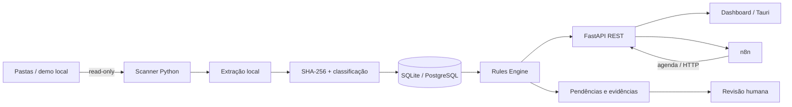

<div align="center">

# Central ISO

**Piloto técnico de Qualidade para transformar conferências documentais manuais em verificações rastreáveis, determinísticas e revisáveis.**

[](https://github.com/Mayconxzdev/Central-ISO/actions/workflows/ci.yml)


[Case no portfólio](https://mayconxzdev.github.io/cases/central-iso/) · [Arquitetura](docs/ARCHITECTURE.md) · [Segurança](docs/SECURITY.md) · [Testes](docs/TESTING.md) · [English](README.en.md)


</div>

> Piloto técnico que criei a partir de um problema real do setor de Qualidade: documentos, certificados e não conformidades espalhados em pasta de rede e conferidos manualmente.

## Por que eu fiz

O acompanhamento dependia muito de pasta de rede, checagem manual e memória de quem conhecia a organização dos arquivos. Conversando com pessoas da Qualidade, vi que parte desse trabalho podia ser transformada em verificações repetíveis e rastreáveis sem alterar os documentos oficiais.

O piloto lê a fonte documental em modo **somente leitura**, identifica o que mudou, extrai conteúdo localmente, aplica regras determinísticas e concentra pendências para revisão humana.

**Estado real:** piloto técnico / prova de conceito funcional. Ele **não é um sistema certificado, não substitui auditoria ISO e não é apresentado como implantação corporativa em produção**.

## O que o projeto mostra

- levantamento de requisitos com stakeholders da Qualidade;
- transformação de regra de negócio em verificação automática;
- leitura de repositório documental em modo `read-only`;
- SHA-256 para idempotência e reprocessamento apenas do que mudou;
- extração local de PDF, DOCX, XLSX, ODT, TXT e CSV;
- acompanhamento de certificados, NCs e documentos do SGQ;
- FastAPI + SQLAlchemy + SQLite/PostgreSQL;
- workflows n8n para agenda, consulta, alertas e recuperação;
- wrapper desktop com Tauri v2;
- Docker Compose para ambiente reproduzível;
- revisão humana antes de qualquer conclusão sensível.

## Fluxo



## Referências visuais

As imagens abaixo são **referências autorizadas do piloto com dados demonstrativos**. Elas ajudam a explicar a interface e o fluxo sem publicar nomes, caminhos, documentos ou contagens do ambiente corporativo original.

| Dashboard | Certificados |
|---|---|
|  |  |

Elas são material demonstrativo, **não prova de produção ou de certificação**. Mais contexto está em [`docs/SCREENSHOTS.md`](docs/SCREENSHOTS.md) e no [case do portfólio](https://mayconxzdev.github.io/cases/central-iso/).

## Stack

| Área | Tecnologias |
| --- | --- |
| Backend | Python, FastAPI, SQLAlchemy, Uvicorn |
| Dados | SQLite no demo, PostgreSQL no ambiente Docker |
| Documentos | PyMuPDF, pypdf, python-docx, openpyxl, odfpy |
| Automação | n8n, REST/HTTP, agendamentos |
| Desktop | Tauri v2 / Rust |
| Infra | Docker, Docker Compose |
| Qualidade | pytest, compileall, GitHub Actions |

## Se quiser avaliar o código, comece aqui

1. [`app/`](app/) — API, domínio, scanner, regras e interface;
2. [`n8n/`](n8n/) — workflows exportados sem credenciais;
3. [`docs/CASE_STUDY.md`](docs/CASE_STUDY.md) — problema, decisões e limites do case;
4. [`docs/SECURITY.md`](docs/SECURITY.md) — decisões de segurança e privacidade;
5. [`tests/`](tests/) — testes automatizados;
6. [`docker-compose.yml`](docker-compose.yml) — ambiente reproduzível.

## Rodar a demonstração

A demo começa em modo sintético e não precisa de infraestrutura da empresa.

```bash
python -m venv .venv
# Windows: .venv\Scripts\activate
# Linux/macOS: source .venv/bin/activate
python -m pip install -r requirements.txt

# PowerShell
$env:APP_DATA_MODE="demo"
$env:ISO_SOURCE_PATH="./demo_iso"
uvicorn app.main:app --reload --port 8877
```

Abra `http://127.0.0.1:8877`.

Com Docker:

```bash
cp .env.example .env
docker compose up --build
```

## Segurança e privacidade

Algumas decisões foram intencionais desde o piloto:

- volume documental montado como `:ro`;
- `.env` fora do Git;
- nenhuma credencial real no repositório;
- `demo_iso/` contém somente dados sintéticos;
- processamento documental local por padrão;
- `AI_MODE=disabled` no demo público;
- nenhuma decisão regulatória automática;
- ações sensíveis continuam com validação humana.

## Testes

A execução mais recente da CI na `main` registrou:

```text
32 passed
compileall aprovado
public-safety scan aprovado
Docker Compose validado
API smoke test aprovado
```

A CI é a referência para o estado atual do repositório; números históricos não são reutilizados como se fossem da versão mais recente.

## O que eu faria diferente hoje

Eu começaria separando ainda mais cedo **inventário documental**, **regras do domínio** e **interface**. O piloto mostrou que a parte mais valiosa não era “ler PDF”, e sim deixar claro **qual regra gerou cada pendência e qual evidência levou àquele alerta**.

Também manteria a mesma decisão de não depender de LLM para decidir conformidade. IA pode ajudar a localizar ou resumir informação no futuro, mas regra crítica precisa continuar explicável e revisável por quem responde pela Qualidade.

## Limites intencionais

Esta versão pública não afirma:

- certificação ISO;
- conformidade normativa automática;
- substituição do responsável da Qualidade;
- autenticação corporativa/SSO;
- IA generativa/RAG em execução;
- deploy corporativo em produção.

## Autor

**Maycon Ferreira**  
Analista de Automação, IA e Integrações  
[Portfólio](https://mayconxzdev.github.io/) · [LinkedIn](https://www.linkedin.com/in/maycon-ferreira-7bb870231/)
